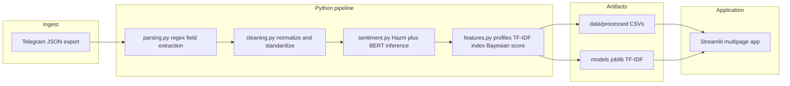

# Elmous Yaar Review Miner

End-to-end mining of Persian university professor reviews from Telegram-exported messages into cleaned tabular data, NLP-derived sentiment labels, TF-IDF–based semantic retrieval with Bayesian-smoothed quality scores, and a multi-page Streamlit dashboard for exploration and comparison.

## Methodology

- **Structured extraction:** Deterministic parsing of semi-structured Persian text via compiled regular expressions; heterogeneous Telegram payload shapes normalized to plain strings before matching.
- **Text normalization & rule labeling:** Persian orthography normalization (e.g. ی/ک variants, ZWNJ handling), regex-based noise stripping in free-text comments, and keyword/rule mapping of raw grading and attendance phrases to discrete standardized labels.
- **Tabular feature construction:** Pandas-based filtering, type coercion, per-review numeric aggregates (six Likert-style dimensions, clipped means), and professor-level profiles via grouped reductions (means, counts, log-count transforms).
- **Information retrieval:** `TfidfVectorizer` on aggregated professor comment corpora (word and bigram features, `min_df` thresholding); query vectors compared to a sparse document–term matrix using cosine similarity.
- **Ranking under sparsity:** Bayesian-style shrinkage of average sentiment toward the global mean with a prior strength derived from the empirical review-count distribution, to reduce variance for low-observation professors.
- **Persian NLP stack:** `hazm` normalizer, word tokenizer, and stopword filtering; transformer sentiment via Hugging Face `pipeline` on a Persian BERT-family checkpoint (ParsBERT-style architecture, fine-tuned for sentiment).
- **Unsupervised analysis (notebooks):** K-means and agglomerative clustering on professor-level feature vectors, with PCA for low-dimensional visualization and cluster labeling.
- **Visualization layer:** Plotly polar, pie, and bar charts; Matplotlib-backed word clouds for term-frequency inspection in profiles.



## Technologies Used

- Python 3.x
- pandas, NumPy
- scikit-learn (`TfidfVectorizer`, `cosine_similarity`, `KMeans`, `AgglomerativeClustering`, `PCA`)
- PyTorch, Hugging Face `transformers` (sentiment `pipeline`)
- hazm (Persian normalization, tokenization, stopwords)
- Streamlit (multipage dashboard: Overview, Search, Compare, Recommender)
- Plotly, Matplotlib, wordcloud
- joblib (serialized TF-IDF vectorizer and matrix for the live recommender)

## Features

- Loads processed review, profile, and recommendation tables from `data/processed` with Streamlit-cached I/O for responsive UI refreshes.
- **Overview:** Dataset-scale metrics, sentiment distribution, and score histograms derived from profile aggregates.
- **Search:** Per-professor drill-down with optional cluster metadata, radar-style multi-metric summary, and comment word clouds.
- **Compare:** Side-by-side selection of two professors with comparative charts built from review-level sentiment tallies.
- **Recommender:** Natural-language preference queries transformed with the fitted TF-IDF model; ranks professors by a tunable convex combination of cosine semantic similarity and Bayesian-smoothed sentiment quality, with query-aligned text snippets.

## Quick Start

```bash
git clone https://github.com/0ALI0ZARGAR0/elmous-yaar-review-miner.git && cd elmous-yaar-review-miner
python3 -m pip install -r requirements.txt
streamlit run app/app.py
```

The repository ships example CSVs under `data/processed`. The **Recommender** page expects `models/tfidf_vectorizer.pkl` and `models/tfidf_search_matrix.pkl`; fit and persist them with the recommender notebook workflow (`notebooks/06_recommender_system.ipynb`) using the same `src.features.build_tfidf_index` API if those files are absent locally.
